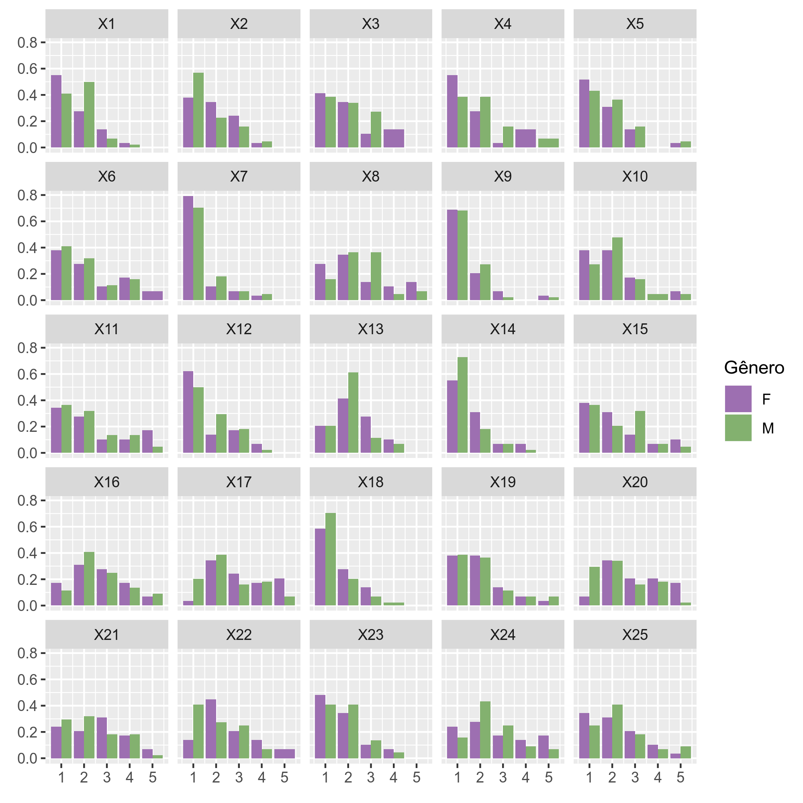
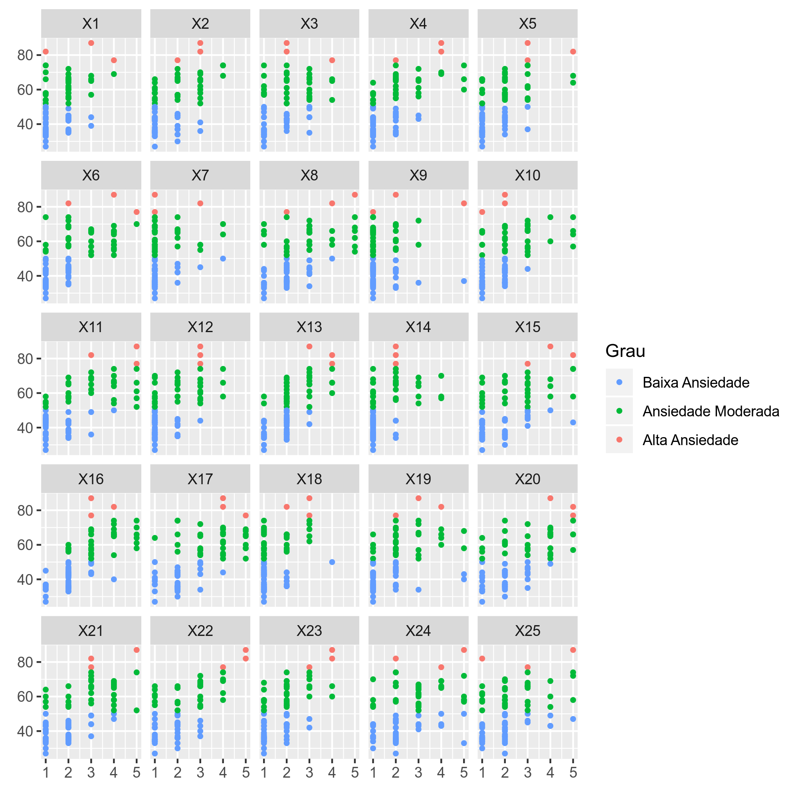
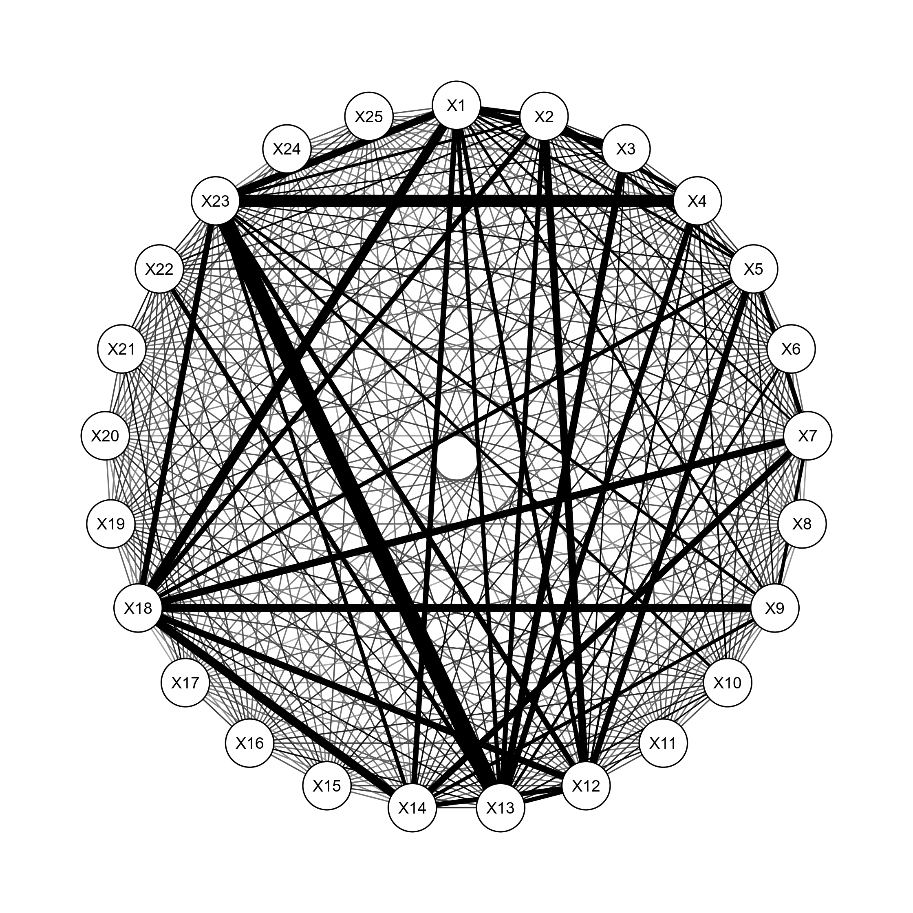

 # Likert-type survey - data processing and analysis
  ## Languages
  This first section is in English. 
  
  [Versão em português logo abaixo.](#portuguese)
  
  ## Context
  Here are some code snippets and images with some visualizations generated in this research.

The main objective in this stage was to perform an Exploratory Data Analysis (EDA), data cleaning, as well as to analyze the data collected. Even though it was a *relatively small* number of participants, it was a survey with a large number of deaf students and that **represented a good portion of this population** of the total population researched in this specific context.

For analysis, different statistical techniques were used to better understand the data and to test hypotheses, such as the principal component analysis (PCA) technique and the analysis of variance (ANOVA) approach.
  
  ## Confidentiality of data and code
This research was approved by the Brazilian research ethics committee (REC), guaranteeing the anonymity of the data. Because of this, and because some of the findings of this research have not yet been published, I decided to only include some code snippets and some visualizations to compose the narrative of this research, but without uploading the complete work.
  
  ## Some highlights of the research findings
Here I bring some statistical and exploratory findings of the research.

### Statistical findings
#### *Cronbach's Alpha*
Through the analysis of *Cronbach's Alpha* it was possible to observe ```89.7%``` reliability.
``` R
questions = 8:32
cronbach.alpha(as.matrix(data[,questions]), CI = TRUE)
```

#### p-value by *Student's t-Test* and *ANOVA*
In the p-value tests by *Student's t-Test* and *ANOVA*, we had values ​​greater than the adopted alpha (```alpha = 5%```), and the null hypothesis could not be rejected. 
```R
fem = data$Total[which(data$Gender == "F")]
mas = data$Total[which(data$Gender == "M")]
t.test(fem, mas)
```
```R
Age = as.factor(data$Age)
Total = data$Total
data2 = data.frame(Age, Total)

model.anova = lm(Total ~ Age, data = data2)
summary(model.anova)

anova(model.anova)
```

### Findings from the exploratory stage - visualizations
I bring here three different visualizations on the 25 contexts/questions present in the survey on Math Anxiety that was the data collection instrument for this research. The visualizations refer to:
- Relationship between *gender* and *anxiety per question*
- Relationship between *total level of Math Anxiety* and *anxiety per question*
- Correlation (by distance graph) between the questions

#### *Gender* and *anxiety per question*
This graph was generated with the normalized data from the responses of the level of math anxiety that each situation (question) provoked, separated by the gender of the research participant.

Below is the code snippet of this graph and its respective visualization.

``` R
ggplot(df_questions, aes(x = value, y = n, fill = Gender)) +
    geom_bar(stat = "identity", position = "dodge") +
    xlab(element_blank()) + ylab(element_blank()) +
    facet_wrap(~variable) + scale_fill_manual(values ​​= colos_gender)
```

<p align="center">
    
</p>

#### *Total level of Math Anxiety* and *anxiety per question*

This graph was generated with the data from the responses of level of math anxiety that each situation (question) provoked, separated by total level of Math anxiety that participants presented based on all 25 situations presented.

Below is the code snippet of this graph and its respective visualization.

```R
ggplot(df_questions_level, aes(x = value, y = Total, color = level)) +
    geom_point(size = 1) +
    xlab(element_blank()) + ylab(element_blank()) +
    facet_wrap(~variable) + scale_color_manual(values ​​= colors_level)
```

<p align="center">
    
</p>

#### Correlation between questions
This graph was generated with general data about all situations (questions) and their response patterns. In this way, it was possible to observe which situations were commonly related.

Below is the code snippet of this graph and its respective visualization.

```R
dist_m = as.matrix(dist(t(score[2:26])))
dist_mi = 1/dist_m^2

qgraph(dist_mi, layout="circle", vsize=5, edge.color = "#000000")
```

<p align="center">
    
</p>

### Considerations on these findings
These findings, along with others that are not present in this GitHub repository, made it possible to identify patterns of Math Anxiety and compare them to academic findings on other studied populations. Some patterns, such as differences by gender and by situations generating greater anxiety, were observed and indicate the importance of future studies on these contexts.
  
  ## Technologies used
 In this project, the ```R``` statistical programming language and ```Jupyter Notebooks``` were used to access and document the codes.
  
  ____
  <br>
  
  # <p id="portuguese">Survey tipo Likert - tratamento e análise de dados</p>
  ## Contexto
  Aqui tenho alguns trechos de código e imagens com algumas visualizações geradas nesta pesquisa.

  O principal objetivo nesta etapa era realizar uma Análise Exploratória dos Dados (EDA), tratamento e limpeza, assim como realizar análises dos dados coletados. Mesmo sendo um número *relativamente pequeno* do total de participantes, foi uma pesquisa com um grande número de estudantes surdos e que **representava uma boa parcela dessa população** da população total pesquisada neste determinado contexto.

  Para análise, foram utilizadas diferentes técnicas estatísticas para uma melhor compreensão dos dados e para testes de hipóteses, como a técnica de análise de componentes principais (PCA) e a abordagem da análise de variância (ANOVA).
  
  ## Sigilo dos dados e código
  Está pesquisa foi aprovada pelo comitê de ética em pesquisa, garantindo o anonimato dos dados. Por conta disso, e de que parte dos achados dessa pesquisa ainda não foram publicados, decidi trazer apenas trechos do código elaborado e algumas visualizações para compor a narrativa dos dados, mas sem divulgar o trabalho completo.
  
  ## Alguns destaques dos achados da pesquisa
  Aqui trago alguns achados estatísticos e exploratórios da pesquisa.

  ### Achados estatísticos
  #### *Alpha de Cronbach*  
  Pela análise do *Alpha de Cronbach* foi possível observar ```89,7%``` de confiabilidade.
  ``` R
    questoes = 8:32
    cronbach.alpha(as.matrix(dados[,questoes]), CI = TRUE)
  ```

  #### p-valor pelo *Test t Student* e *ANOVA*
  Já nos testes de p-valor pelo *Test t Student* e *ANOVA*, tivemos valores maiores do que alpha adotado (```alpha = 5%```), não podendo rejeitar a hipótese nula.
  ```R
    fem = dados$Total[which(dados$Gênero == "F")]
    mas = dados$Total[which(dados$Gênero == "M")]
    t.test(fem, mas)
  ```
  ```R
    Idade = as.factor(dados$Idade)
    Total = dados$Total
    dados2 = data.frame(Idade, Total)

    modelo.anova = lm(Total ~ Idade, data = dados2)
    summary(modelo.anova)

    anova(modelo.anova)
  ```
  
  ### Achados da etapa exploratória - visualizações
  Sobre as visualizações, trago aqui três diferentes visualizações sobre as 25 questões presentes na survey sobre Ansiedade à Matemática que foi o instrumento de coleta de dados desta pesquisa. As visualizações se referem à:
  - Relação entre *gênero* e *ansiedade por questão*
  - Relação entre *nível total de Ansiedade à Matemática* e *ansiedade por questão*
  - Correlação (por gráfico de distâncias) entre as questões

  #### *Gênero* e *ansiedade por questão*
Este gráfico foi gerado com os dados normalizados a partir das respostas de grau de ansiedade à matemática que cada situação (questão) proporcionava, separados por gênero do participante da pesquisa.

Abaixo está o trecho do código que gerou este gráfico e sua respectiva visualização.

``` R
ggplot(df_questoes, aes(x = value, y = n, fill = Gênero)) + 
  geom_bar(stat = "identity", position = "dodge") + 
  xlab(element_blank()) + ylab(element_blank()) + 
  facet_wrap(~variable) + scale_fill_manual(values = cores_genero)
```

<p align="center">
    
</p>

  #### *Nível total de Ansiedade à Matemática* e *ansiedade por questão*

Este gráfico foi gerado com os dados a partir das respostas de grau de ansiedade à matemática que cada situação (questão) proporcionava, separados por grau total de ansiedade à matemática que os participantes apresentavam a partir de todas as 25 situações apresentadas.

Abaixo está o trecho do código que gerou este gráfico e sua respectiva visualização.

```R
ggplot(df_questoes_grau, aes(x = value, y = Total, color = Grau)) + 
  geom_point(size = 1) + 
  xlab(element_blank()) + ylab(element_blank()) + 
  facet_wrap(~variable) + scale_color_manual(values = cores_grau)
```

<p align="center">
    
</p>

  #### Correlação entre as questões
Este gráfico foi gerado com os dados gerais sobre todas as situações (questões) e os padrões de resposta delas. Desse modo, foi possível observar quais questões comumente estavam relacionadas a partir de um gráfico.

Abaixo está o trecho do código que gerou este gráfico e sua respectiva visualização.

```R
dist_m = as.matrix(dist(t(pontuacoes[2:26])))
dist_mi = 1/dist_m^2

qgraph(dist_mi, layout="circle", vsize=5, edge.color = "#000000")
```

<p align="center">
    
</p>
  
### Considerações sobre estes achados
Esses achados, junto com os outros que não estão presentes neste repositório do GitHub, possibilitaram identificar padrões de Ansiedade à Matemática e compará-los aos achados acadêmicos sobre outras populações estudadas. Alguns padrões, como diferenças por gênero e por situações geradoras de maior ansiedade, foram observadas e indicam a importância de estudos futuros sobre esses contextos.

  ## Tecnologias utilizadas
  Neste projeto, foram utilizados a linguagem ```R``` de programação estatística e os ```Jupyter Notebooks``` para acesso e documentação dos códigos.
  